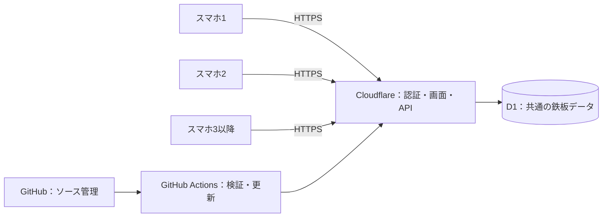

# アーカイブ：クラウド構成の検討

**廃止済みのSite版に関する検討資料です。現行システムの仕様・手順ではありません。現在の開発対象はPC版のみです。**

2026年9月27日時点。現行コードと各社公式資料を確認した設計案。契約、アカウント作成、移行、公開設定の変更は行っていない。

## 推奨

**管理者所有のCloudflare Workers＋D1を利用し、画面とAPIを同じURLで提供する。初版は既存の同期処理を活かし、Workers Paid（月5米ドルから）を候補とする。**

管理者だけがクラウドの契約・設定を担当し、調理する人に管理者のCloudflare・GitHub・ChatGPTアカウントを渡さない。PCの電源は利用条件にならず、スマホはWi-Fi・モバイル回線のどちらからでもアクセスできる。インターネット接続は必要。

利用者の参加方法は次の2案がある。アカウント共有を避けるだけならAが最小改修。専用スマホにメールアカウントを設定したくない場合はBが適する。

| 参加方法 | 利用者の操作 | 実装・運用上の特徴 |
| --- | --- | --- |
| A：個別メール認証 | 自分のメールに届く一時コードでログイン | Cloudflare Accessを利用。管理者が許可したメールだけ利用できる。調理者のCloudflareアカウント作成は不要 |
| B：端末登録 | 管理者が発行した一回限りのQRからスマホを登録 | メール・個人アカウント不要。アプリに端末管理を追加し、スマホごとに利用権限を保持・失効できるようにする |

[Cloudflare Accessの一時コード認証](https://developers.cloudflare.com/cloudflare-one/integrations/identity-providers/one-time-pin/)は許可済みメールアドレスにコードを送る。少人数向けの[Access無料プラン](https://www.cloudflare.com/sase/products/access/)があり、今回仮定する5人規模はその対象内。Workersの有料プランとは別の製品・料金枠。

## 構成

画面はReact、タイマー描画は端末内で行う。サーバーが確定した開始時刻・設定時間・配置をD1に保存する。毎秒DBを書き換えず、各端末が時刻から残り秒数を計算する。操作の二重適用防止と同時操作の競合検出は既存処理を維持する。

画面とAPIをCloudflareへまとめるためGitHub Pagesは必須ではない。GitHubは非公開リポジトリでのソース管理と、Actionsによるテスト・デプロイに使える。クラウドへのデプロイ用認証情報はActionsのSecretsに保存する。[公式デプロイ手順](https://developers.cloudflare.com/workers/ci-cd/external-cicd/github-actions/)

## 他の候補との比較

| 候補 | 料金の入口 | 現行実装からの変更 | 今回の評価 |
| --- | --- | --- | --- |
| Cloudflare Workers＋D1 | 無料枠あり。Workers Paidは月5米ドルから | Sites固有認証・設定を置換。D1保存処理と画面を再利用できる | 第一候補 |
| Firebase Hosting＋Realtime Database＋Authentication | Spark無料枠あり。超過利用や利用機能によりBlaze従量課金 | 保存処理・同期・アクセス制御をFirebase向けに再設計 | 無料運用と変更通知を重視する場合の候補 |
| 静的ホスティング＋Supabase | Freeあり。Proは月25米ドルから | D1をPostgreSQLへ移し、認証・権限制御・同期を置換 | 将来、店舗・利用者・集計を大きく拡張する場合の候補 |

Firebase Realtime DatabaseのSpark枠は同時接続100、保存1GB、ダウンロード月10GB。接続数だけでなくデータ転送と必要なサーバー機能を確認する。今回の承認・操作検証をどう配置するかによって有料プランが必要になるため、無料確約はしない。[Firebase料金](https://firebase.google.com/pricing)

Supabase Freeは1週間活動がないとプロジェクトが停止するため、間欠的なイベント運用では復帰手順が必要。Supabase料金は画面配信側の料金を含まない。[Supabase料金](https://supabase.com/pricing)

この比較の変更量・適性は、現行コードがWorkers / D1を使用していることに基づく設計判断。

## 利用料金の試算

未確定の端末数・稼働時間には、**スマホ5台、画面を表示して1日8時間、月30日**を仮定する。金額は米ドル、税・為替・独自ドメイン・別サービスの超過料金は含めない。

現行 `lib/use-kitchen.ts` は、状態取得の完了後に700ms待って次の取得を行う。通信時間を含む実際の間隔は変動する。

| 取得間隔の仮定 | 状態取得／日 | 状態取得／30日 |
| --- | ---: | ---: |
| 1秒 | 144,000回 | 4,320,000回 |
| 0.7秒（通信時間を無視した上限近似） | 約205,714回 | 約6,171,429回 |

式：端末数 × 稼働時間 × 3,600 ÷ 取得間隔。追加・開始・調整・削除、ログイン、再接続、他アプリの利用分は別途加算する。画面非表示中は現行実装でも定期取得を停止する。

Workers Freeは1日10万リクエスト。したがってこの使い方では、現在の取得方式のまま無料枠を前提に本番運用するのは不適切。Workers Paidは月5米ドルの最低料金で月1,000万リクエストとCPU時間枠を含む。上の試算はリクエスト枠内だが、CPU利用量は実測が必要。[Workers料金](https://developers.cloudflare.com/workers/platform/pricing/)

D1の有料枠には月250億行の読み取り・5,000万行の書き込み・5GBの保存が含まれる。今回の小さい共有ボードでは十分な余裕が見込まれるが、課金対象は返却行数だけではなく走査行数も含むため、インデックスを使い実測する。[D1料金](https://developers.cloudflare.com/d1/platform/pricing/)

予算の出発点は月5米ドル＋必要な超過分。固定額の保証ではない。API応答のCPU時間、DB操作量、同時利用数を試験して確定する。利用量通知は料金上限そのものではない。

## 無料枠を優先する場合

Cloudflare内でも、Durable Objects＋WebSocketによる変更通知へ移す案がある。スマホが毎秒問い合わせる代わりに、追加・開始・時間変更・削除が確定した時だけ接続中の端末へ通知する。残り時間の描画は引き続き端末内で計算する。

Durable ObjectsのSQLite版には無料枠があり、WebSocket Hibernationを利用すると接続を維持しつつ待機中の計算料金を抑えられる。[料金](https://developers.cloudflare.com/durable-objects/platform/pricing/)、[WebSocketとHibernation](https://developers.cloudflare.com/durable-objects/best-practices/websockets/)

ただし同期処理・接続復帰・保存処理を変更するため、初回移行の作業量は増える。採用する場合は1調理ボードを1つのDurable Objectで管理し、共有状態の正本をそのSQLiteに置く案を検証する。D1との二重保存を初版から導入しない。通知量、接続再確立、稼働時間などにも上限があり、無料を保証する構成ではない。

最初はD1＋既存の定期取得を使う案を推奨する。無料を必須条件にする場合は、移行前にこの変更通知方式を試作・負荷測定して選択する。

## 認証の実装方針

### A：個別メール認証

- Accessで本番の画面と全APIを保護し、利用者のメールを許可リストに登録する。
- ChatGPT固有の認証ヘルパーを置換し、確認済みの利用者IDを操作履歴のactorに使う。
- カスタムドメイン、標準URL、プレビューなど別経路から認証を迂回できない設定にする。
- ログイン期限切れを画面で案内し、通信エラーと区別する。調理途中の再ログインと復帰も検証する。
- WorkersのStatic Assetsを使う構成では `ctx.access` がアプリWorkerへ届かない制約が公式資料にある。移行先の配信構成を確認し、必要な場合はAccessの署名済みトークンを検証する。単なるメールヘッダーを信用しない。[WorkersとAccess](https://developers.cloudflare.com/workers/configuration/cloudflare-access/)

### B：端末登録

- 管理者は個別メール認証で管理画面へ入る。調理端末へ管理者のセッションをコピーしない。
- 管理者が端末名を指定し、短時間だけ有効な一回限りの登録QRを発行する。
- スマホで開いた後の登録操作でQRを消費し、端末固有のセッションを発行する。リンクのプレビュー取得だけで消費しない。
- 登録トークンは推測困難にし、サーバー側ではハッシュで保存。有効期限と使用済み判定を同時に検証する。
- 端末セッションはSecure / HttpOnly Cookieなどで保持し、サーバー側で有効性と権限を確認する。URLや画面のJavaScriptにクラウド管理キーを埋め込まない。
- 管理者は端末単位で失効できる。ブラウザーの保存データを消した場合は再登録する。
- 全端末で使い回す永続的なQR・共通パスワードにはしない。画面とAPIの両方で権限を確認する。

AとBは利用者認証の選択肢。Bで調理端末にメール認証を要求しない場合、Accessをサイト全体へ一律適用せず、管理画面の保護とアプリの端末認証を設計して分離する。

## 移行の手順と完了条件

1. 管理者所有のCloudflare環境とソース管理先を準備する。アプリ用Workers・D1を用意し、Sitesのデプロイ設定と認証への依存を置換する。
2. AまたはBを実装する。調理画面と既存の操作検証、時刻補正、競合制御は再利用する。
3. 検証用と本番のDB・認証・設定を分離し、GitHub Actionsでテスト・ビルド・更新を行う。
4. 実機5台を想定して、Wi-Fiとモバイル回線の混在、同時操作、画面ロック復帰、再送、ログイン期限切れ、権限削除を検証する。変更の共有は通常約1秒を初期目標とし、実回線で測定する。
5. 8時間相当の負荷でリクエスト数・CPU時間・DB利用量を測定する。端末別の時計を意図的にずらしてもタイマーの基準が揃うことを確認する。
6. 調理を行っていない時間に切り替える。新しい空のボードで開始するか、必要な状態を移すかを決め、稼働中タイマーを安易に複製しない。
7. バックアップと復元を確認する。D1のTime Travelは有料30日、無料7日の復元履歴を提供する。[復元機能](https://developers.cloudflare.com/d1/reference/time-travel/)

回線が切れた端末は保存済み時刻から表示を続けるが、共有操作を止め、復帰時にサーバーの最新状態を取得する。クラウド構成でもインターネット障害中の全端末同期はできない。

今回の推奨は「既存実装を活かすCloudflare＋D1」「運用開始時は月5米ドルからの有料枠を検討」「個別メール認証、またはメールを使わない端末登録」。利用台数・稼働時間・参加方法が確定すれば、移行仕様と費用見込みを絞れる。
