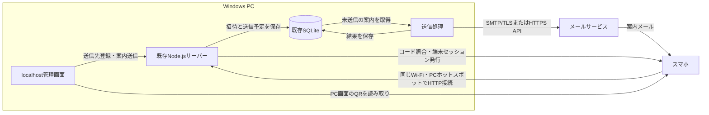

# スマホへの接続案内・登録コード送信の設計案

> **2026-10-02更新：この設計案は採用しません。** スマホを固定1台にし、登録・認証・外部案内の送信を不要とする前提に変わりました。固定スマホ内へ調理状態を保存する[GitHub Pages構成](single-phone-github-pages-architecture.md)を参照してください。

作成日：2026-09-30  
状態：設計案。アプリへの実装・外部送信は未実施。

## 1. 採用する構成

ユーザーが指定した条件は「スマホはPCと同じネットワーク内で使う」「送信方法は指定なし」。既存のWindows PC、Node.js、SQLiteを使い、PCの管理画面に送信先一覧と案内送信を追加する。初期の送信方法はメールとし、同じ登録案内をQRコードでも渡せるようにする。

メールを第一候補にする理由は、送信元のメールサービスを設定すればPCから外向きの通信で送信でき、電話番号やLINEの連携登録を必要としないこと。利用者がスマホで受信できるメールアドレスを持ち、送信元として利用可能なメールアカウント／サービスを用意できることが導入条件になる。料金は送信元サービスに依存し、無料を保証しない。



Node.jsは現在の1プロセスで動かす。送信処理は非同期に実行し、SQLiteに送信予定を保存する。送信中に調理操作のAPIを待たせない。PC内の永続的な送信待ち一覧で、この規模の再起動・通信切断への対応を行う。

外部メールサービスへ渡す情報は宛先と案内文面。調理状態と端末セッションの正本はPC内SQLiteに置く。PCにはメール送信用のインターネット接続が必要だが、送信サービスが使えない場合でもQRによる登録案内とローカルの調理操作を利用できる。

## 2. 送信先と端末の利用権限

現在の「端末登録」は、登録コードを入力したブラウザーにCookieを発行する処理。電話番号や物理的なスマホ本体の識別番号を登録しているわけではない。

そこで、次の情報を別々に管理する。

| 情報 | 意味 | 保存する内容 |
| --- | --- | --- |
| 送信先 | 誰に案内を届けるか | 表示名、メールアドレス、送信方法、有効／停止 |
| 招待 | 今回どの送信先を登録させるか | 送信先ID、コードのハッシュ、期限、使用／取消状態 |
| 端末セッション | どのブラウザーが調理画面を使えるか | 現行の端末ID、セッションのハッシュ、期限、停止状態、送信先ID |
| 送信予定・結果 | 案内の送信がどこまで進んだか | 招待ID、宛先とURLのスナップショット、状態、再試行情報、サービス側ID |

送信先を追加した時点では、調理画面の利用権限は発行しない。スマホがコードを使用した時点で、その送信先と端末セッションを関連付ける。1つの送信先に複数の端末セッションが存在できる。

既存の端末には送信先IDをNULLで追加し、管理画面で後から関連付けられるようにする。同じ名前だけを根拠に自動で関連付けない。

## 3. 利用者の流れ

1. 管理者がPCで「調理台スマホ1」などの名前と、スマホで受信できるメールアドレスを登録する。
2. PC側の接続ネットワークと案内用URLを選ぶ。ホットスポット利用時はそのインターフェースのURLを使う。
3. 管理者が「登録案内を送る」を押す。スマホごとに一回限りのコードを作り、メール送信予定を保存する。同じ招待についてPC画面にコードとQRも表示する。
4. スマホを指定されたWi-Fiへ接続する。メールのリンクを開き、コードを貼り付ける。QRを使う場合はコードを入力済みの登録画面を開く。
5. 利用者が「この端末を登録」を押す。既存の`POST /api/enroll`で照合して、30日間有効の端末セッションを発行する。
6. PCにはメールの送信受付状況と、スマホの登録完了・接続状態を表示する。

送信例：

```text
鉄板タイマーの登録案内

Wi-Fi「<利用するWi-Fi名>」につないでから開いてください。
利用リンク：http://<PCのIPv4>:8780/
登録コード：<端末ごとのコード>
有効期限：<発行日時から15分後の絶対日時>
```

Wi-Fi名は管理者が設定できる案内情報とする。メッセージを受け取っただけでは、そのスマホがPCへ到達できるとは判断しない。

メールの標準リンクは`/`を使う。現行サーバーは有効なセッションを持つブラウザーなら調理画面を表示し、未登録なら`/register`へ誘導する。

QRでコードを入力済みにする場合は、`/register#code=<コード>`を使う。登録画面がフラグメントを読み取って入力欄へ設定し、その後URLから除く。リンクを開くだけではコードを消費しない。必ず利用者による登録ボタンのPOSTで確定する。

## 4. 登録済みスマホへの案内

管理画面では2つの操作を分ける。

| 操作 | 送信するもの | 用途 |
| --- | --- | --- |
| 利用リンクを送る | 現在のPCの利用URLとWi-Fi案内 | 登録済み端末にURLを再案内する |
| 登録案内を送る | 利用URL、端末ごとの新しいコード、有効期限 | 初回登録、Cookie削除、別ブラウザーでの登録、期限切れ後の再登録 |

利用リンクの再案内では新しい端末セッションを作らない。再登録を行うと現在の実装では別の端末レコードができるため、既存端末の停止は管理者が明示して行う。

停止した送信先への案内送信は受け付けない。停止した端末セッションを案内送信だけで復活させない。

## 5. URLの決め方

現在はPCのネットワークアダプターを列挙して複数の候補URLを表示している。自動送信では、その中から運用に使う1つを選んで保存する。

- 設定項目は、接続方式、インターフェース、PC側IPv4、ポート、Wi-Fi表示名。
- PCホットスポットを優先候補にする。候補が複数ある場合は初期設定で管理者が選ぶ。
- `localhost`、`127.0.0.1`はスマホ用URLとして使用しない。
- 送信前に選んだIPが現在のアダプターに存在するか確認する。存在しなければ「ホットスポットを確認してください」と表示し、送信を保留する。
- 送信予定には、その時点の宛先とURLを保存する。設定変更時は未送信の案内を取り消し、新しいURLで作り直す。
- 同じWi-Fiを使う場合はPCのIPをルーターで固定予約する。ホットスポットも現在のアドレスを確認して使う。

現在のCookieは接続先のホストに対して保存される。PCのIPを変更すると、新しいIPへ以前のCookieは送られない。別IPへ変更する場合は、登録し直しが必要になる端末があると管理画面で案内する。

## 6. 送信の保存と再試行

登録案内の作成は、短いSQLiteトランザクションで以下をまとめて保存する。

1. 送信先ID付きの招待コードのハッシュと15分の期限。
2. 案内文面を暗号化した送信予定。
3. 二重クリック・API再送を識別する管理操作ID。

管理APIは保存後に`202 Accepted`を返す。最初の応答では招待ID、期限、QR表示用のコードを管理画面へ一度だけ返す。同じ操作IDの再要求には保存済みの招待IDと状態を返し、平文コードを再表示しない。送信処理はDBトランザクションを終了してから外部メールサービスへ接続する。管理操作IDが同じ要求に、新しいコードと送信予定を重複して作らない。

現行のコード本体はハッシュだけでは再取得できないため、送信予定の文面だけを期限内の再試行用に暗号化して保持する。暗号鍵と送信サービスの認証情報はPC側で管理し、フロントエンド、Git、通常ログ、SQLiteバックアップには含めない。文面は送信受付成功、取消し、期限切れなど、再試行が不要になった時点で削除する。

送信状態は`queued`（待機）、`sending`（送信中）、`accepted`（サービス受付）、`failed`（失敗）、`unknown`（受付不明）、`canceled`（取消）を基本にする。到達確認を提供するサービスを採用した場合だけ`delivered`を追加する。

- 接続前の明確な一時エラーは、同じコードで期限内に限定回数再試行する。
- サービスが受け付けた可能性があるタイムアウトは`unknown`とし、無条件に自動再送しない。通常のSMTPでは送信の一度だけの実行を保証できない。
- PC再起動後に残った`queued`は期限を確認して再開する。中断された`sending`はサービス照会／重複防止機能があればそれを使い、確認できなければ`unknown`にする。
- コード期限を過ぎたメールは新たに送信しない。遅れて届いた場合は、管理者が未使用の旧招待を取り消して新しい案内を発行する。
- 管理者による「再発行」は、同じ送信先の旧未使用コードを取り消してから、新しい招待を作る。
- SMTPの受付成功をスマホへの到達成功として表示しない。アプリ側の登録完了は`enrollment_codes.used_at`で別に判断する。

一括案内はスマホごとにコードとメールを作る。共通コードや宛先をまとめたメールを使わない。

## 7. 追加する実装の位置

| 変更箇所 | 役割 |
| --- | --- |
| `pc-client/src/admin.tsx` | 送信先一覧、接続先設定、登録案内／利用リンク送信、QR、送信状況 |
| `pc-client/src/register.tsx` | QR由来のコード入力、登録前の確認 |
| `server/index.mjs` | localhost限定の送信先・案内・送信状況API |
| `server/storage.mjs` | 送信先、招待の関連付け、送信予定と結果の保存 |
| `server/invitations.mjs`（追加） | コード発行、案内文面の生成、再発行・取消し |
| `server/delivery-worker.mjs`（追加） | 送信予定の処理、限定再試行、状態保存 |
| `server/delivery/email.mjs`（追加） | メールサービスへの接続 |
| `server/connection-settings.mjs`（追加） | スマホ用の接続URL選択と確認 |

API案：

```text
GET/POST      /api/admin/recipients
PATCH         /api/admin/recipients/:id
GET/PUT       /api/admin/connection-settings
POST          /api/admin/invitations
POST          /api/admin/usage-links
GET           /api/admin/deliveries
POST          /api/admin/invitations/:id/cancel
POST          /api/admin/invitations/:id/reissue
POST          /api/enroll                       既存処理を拡張
```

送信APIも現在の管理APIと同じlocalhost判定とOrigin確認を使う。メールサービスの認証情報はサーバーだけで使う。調理状態のAPIと同期処理は既存のものを使える。

DBでは`recipients`と`delivery_jobs`を追加し、`enrollment_codes`と`devices`にNULL許容の`recipient_id`を追加する。送信予定の宛先・URL・Wi-Fi表示名は作成時点の値で保存する。

送信方法ごとの差は`send(message)`と、提供される場合の`getStatus(providerMessageId)`に集約する。SMTP接続ならNodemailer等でTLSを必須にする。送信元サービスの制約に応じてHTTPS APIを使う実装へ差し替えられるようにする。

## 8. 代替方式との比較

| 方式 | 今回の位置付け | 主な条件 |
| --- | --- | --- |
| メール | 初期の自動送信に採用 | スマホで使える受信アドレス、送信元の認証設定、PCのインターネット接続 |
| QR | 同時に用意する現地の登録手段 | スマホでPC画面を読み取れること。宛先への自動配信は行わない |
| SMS | 必要になれば送信部分を追加 | 電話番号、SMSサービス、料金と国内配送条件の確認 |
| LINE | 利用者がLINEを希望する場合の拡張 | 公式アカウント、送信用ユーザーID、通常はユーザーID取得用の公開HTTPS受信先 |
| ブラウザーのプッシュ通知 | 初回登録用には採用しない | HTTPS、Service Worker、通知購読などを先に設定する必要がある |

LINEへの送信に使うユーザーIDは、友だち検索用のLINE IDとは異なる。Webhookで取得する通常の連携を採用する場合は公開HTTPS受信先が必要になり、現在のPC内完結の構成より導入項目が増える。

SMSはPCから外向きにAPI送信できる。Twilio等ではサービス側IDを使った状態取得も可能なので、公開Webhookを置かずPC側から照会する構成を選べる。

ブラウザーのプッシュ通知は、現行のローカルHTTPアプリに通知購読が存在せず、初回案内を届けるまでの設定が増える。将来、登録後の調理通知を要件にする際に検討する。

## 9. 導入の順序と確認事項

1. 送信先一覧と案内URLの選択を作る。
2. 端末別の招待とQRを作り、コード照合・使用・取消しを既存処理へ接続する。
3. メール送信処理と送信予定の保存を追加し、送信元アカウントを設定する。
4. 実スマホでメール受信、Wi-Fi接続、登録、利用リンクの再案内を確認する。

実装時には一時DBとメール送信の代替実装を使い、二重要求、PC再起動、期限切れ、送信受付不明、コード再利用拒否を確認する。実送信と実スマホでの確認は別に行う。今回の設計段階では実行していない。

現行スマホ用URLはHTTPのままになる。メール送信の追加はこの通信経路をHTTPS化しない。HTTPSが必要な運用にする場合は、スマホが信頼できる証明書と安定した接続先名を含めて別に設計する。

## 10. 参照資料

現行実装：

- [PC版README](../cooking-app/README.md)
- [管理画面](../cooking-app/pc-client/src/admin.tsx)
- [登録画面](../cooking-app/pc-client/src/register.tsx)
- [APIとルーティング](../cooking-app/server/index.mjs)
- [コードと端末セッション](../cooking-app/server/storage.mjs)

2026-09-30に確認した公式資料：

- [Nodemailer：SMTPとTLS設定](https://nodemailer.com/smtp)
- [Twilio：SMS送信APIと状態](https://www.twilio.com/docs/messaging/api/message-resource)
- [Twilio：WebhookまたはAPI照会による状態確認](https://www.twilio.com/docs/usage/webhooks/messaging-webhooks)
- [Twilio：日本向け配送条件](https://www.twilio.com/en-us/guidelines/jp/sms)
- [LINE：送信用ユーザーIDの取得](https://developers.line.biz/en/docs/messaging-api/getting-user-ids/)
- [LINE：メッセージ送信](https://developers.line.biz/en/docs/messaging-api/sending-messages)
- [MDN：Push API](https://developer.mozilla.org/en-US/docs/Web/API/Push_API)
- [MDN：HTTPSが必要なPushEvent](https://developer.mozilla.org/en-US/docs/Web/API/PushEvent)
- [MDN：Cookieのホストへの保存範囲](https://developer.mozilla.org/en-US/docs/Web/HTTP/Reference/Headers/Set-Cookie)
