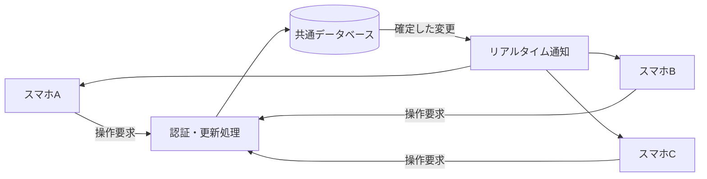

# アーカイブ：食品調理管理システム 実装計画

**この資料はSite版を含む過去の計画です。現行実装は[PC版README](../cooking-app/README.md)を参照してください。Site版は開発対象から除外されています。**

作成日：2026年9月27日  
対象：2枚の鉄板上のお好み焼きの位置と調理時間を、複数のスマートフォンで共有・操作するシステム。  
状況：初版アプリ実装済み。この文書には初期構想も残している。追加サービス料金なしでPCをサーバーとし、モバイル回線から接続するための現行計画は [PC・モバイル回線向け実装計画](pc-mobile-implementation-plan.md) を参照。

> 実装時の構成変更（2026年9月27日）：追加の外部アカウント設定なしで利用できるよう、初版はSites上のReact/VinextとCloudflare D1を採用する。Supabase案に代わり、サーバー側の版番号付き更新と約1秒間隔の取得で端末を同期する。以下の操作仕様・時刻計算・競合対策は維持する。初回公開は所有者限定で、各スマホから同じ所有者アカウントでサインインする。スタッフ別アカウントへの共有範囲変更は別途設定する。

## 1. 推奨方針と前提

**スマートフォン向けWebアプリ（PWA）と、共通のクラウドデータベースを組み合わせる。** 同じ調理画面に参加した全端末が、楕円の位置・開始時刻・設定秒数・削除結果を共有する。

- 通信環境は、ユーザー回答に基づきインターネット接続ありとする。
- iPhoneのSafari、AndroidのChromeを対象に、実際の運用端末で検証する。具体的なOS・ブラウザーの最低対応版は端末確認後に固定する。
- ブラウザーで利用でき、対応環境ではホーム画面から起動できる構成にする。PWAのインストール方法や対応状況は環境に依存する。[MDN：PWA](https://developer.mozilla.org/en-US/docs/Web/Progressive_web_apps)
- 最初の検証規模は、同時接続5台、鉄板1枚あたり12個、合計24個の楕円を目安とする。これは負荷試験の条件であり、確定した運用台数や設置上限ではない。
- 各端末の時計や「1秒ごとの減算」を正しい時刻の根拠にしない。サーバー基準の開始時刻・終了時刻から表示を計算する。

以下は、要件に明記されていないため本計画の暫定仕様とする。

| 項目 | 暫定仕様 |
| --- | --- |
| タイマー開始 | 空白の楕円をタップするとすぐ開始 |
| 初期設定時間 | 100秒 |
| 左右スワイプ | 左で1秒短縮、右で1秒延長。1回の操作で1段階変更 |
| 設定可能時間 | 90〜110秒、1秒刻み |
| 調整対象 | 残り秒数ではなく、開始から終了までの合計時間 |
| 楕円の重なり | 操作の取り違えを避けるため、重なった配置を受け付けない |
| 終了後の再開始 | 赤い楕円は再開始せず、上スワイプで削除してから新規作成 |

## 2. 画面と操作仕様

### 鉄板の表示

- 「鉄板1」「鉄板2」の2つの四角い枠を常に同じ画面に表示する。試作では正方形とする。
- 縦向きでは上下、横向きでは左右に配置し、縦横比を保って画面内に収める。
- 鉄板の番号、接続状態、短い操作ガイドを表示する。調理操作をメインにし、設定類は別画面に分ける。
- 小さい画面でも楕円の数字とタッチ範囲を確保する。画面の縦横比、ブラウザーのアドレスバー、セーフエリアを含めて実機で確認する。
- 鉄板と楕円の形状・座標は共通の論理座標系で扱い、画面サイズに応じて拡大縮小する。端末ごとに配置が変わらないようにする。

### 状態と操作

| 状態 | 表示 | 操作・変化 | 結果 |
| --- | --- | --- | --- |
| 未設置 | 鉄板の空き領域 | タップ | タップ位置を中心に空白の楕円を設置 |
| 空白 | 白い背景と輪郭。数字なし | 楕円をタップ | 初期設定100秒で計測開始（暫定） |
| 計測中 | 黒い楕円と残り秒数。経過に応じて上から白くなる | 左右スワイプ | 設定時間を90〜110秒の範囲で変更 |
| 計測中 | 同上 | 終了時刻に到達 | 楕円全体を赤くし、0秒を表示 |
| 終了 | 赤い楕円と0秒 | 上スワイプ | 全端末から楕円を削除 |

「黒いタイマー」は、楕円が黒い背景になり、中央に残り秒数が表示されるものと解釈する。数字は白い小さなラベル上に黒字で描画し、背景が黒・白・赤に変わっても読みやすさを維持する。

### 配置・ジェスチャーのルール

- 楕円の大きさは共通設定とし、自由な位置に置ける。最初から固定グリッドにはしない。
- 枠の端では楕円全体が収まる範囲へ中心座標を補正する。
- 既存の楕円を触った操作で、新しい楕円が追加されないようにイベントを分離する。
- 左右スワイプは、白い領域が増えた計測中の楕円でも受け付ける。
- 計測中のタップでは再開始しない。終了前の上スワイプでは削除しない。
- タップ、横スワイプ、上スワイプを指の移動量と方向で区別する。たとえばタップは移動10px未満、スワイプは30px以上を初期値にし、実機で調整する。単位はCSSピクセル。
- 斜め操作は主方向が明確なときだけ受け付ける。1回の接触で複数の命令を発行しない。
- 操作は指を離した時点で確定する。途中でタッチがキャンセルされた場合は変更しない。
- Pointer Eventsとポインターキャプチャを利用し、指が楕円の外に出ても操作対象を維持する。スクロールとの競合は操作領域の`touch-action`で調整する。[MDN：Pointer events](https://developer.mozilla.org/en-US/docs/Web/API/Pointer_events)
- 送信中は対象に処理中の表示を付け、二重操作を防ぐ。失敗時は確定済み状態に戻し、短い理由を示す。

## 3. タイマーの計算と表示

保存するのは開始時刻と設定時間であり、毎秒変化する残り時間をデータベースに書き込まない。

```text
終了時刻 = サーバーが確定した開始時刻 + 設定秒数
残り時間 = max(0, 終了時刻 - サーバー基準の現在時刻)
表示秒数 = ceil(残り時間を秒に換算)
白い部分の高さの割合 = clamp(経過時間 / 設定時間, 0, 1)
```

- 開始直後は黒、半分経過したら上半分が白・下半分が黒、終了時は全面を赤にする。白くなる境界は水平で、上から下へ進める。
- 数字は秒単位で変わり、塗り分けは滑らかに更新する。更新処理は再描画のきっかけにだけ使い、経過時間そのものは時刻差から求める。
- 各楕円に個別の常駐タイマーを作らず、画面共通の時刻更新で描画する。
- サーバー時刻の取得時に通信往復時間を測り、端末時計とのずれを補正する。起動時、再接続時、画面復帰時、および表示中の定期的な時刻確認で更新する。
- 稼働中の経過計測には単調増加時計を利用し、端末の時計変更による飛びを抑える。スリープからの復帰時は再同期する。
- 画面が非表示の間はブラウザーのタイマーや描画が制限されることがあるため、復帰時に保存済みの終了時刻から再計算する。[MDN：Page Visibility API](https://developer.mozilla.org/en-US/docs/Web/API/Page_Visibility_API)

### 計測中の時間変更

合計時間の変更では、開始時刻を変えない。

例：100秒設定で20秒経過後、右スワイプを1回すると、設定は101秒、残りは約81秒になる。101秒から数え直す動作にはしない。

- 左端は90秒、右端は110秒とし、それ以上の変更は受け付けない。
- 短縮によって終了時刻が現在時刻以前になった場合は、その場で赤くする。
- 時間変更に合わせて塗り分け率も再計算するため、延長時は黒い部分が少し増える。
- すでに終了した楕円への延長要求は、サーバー側でも拒否する。終了直前の操作可否は、サーバーで処理した時刻を基準にする。

## 4. システム構成

| 部分 | 採用案 | 役割 |
| --- | --- | --- |
| 画面 | React + TypeScript + Vite | スマホ表示、操作、状態管理 |
| 図形 | SVG | 鉄板、楕円、文字、塗り分け、共通座標での描画 |
| 配信 | HTTPSで配信するPWA | ブラウザー利用、対応端末でのホーム画面起動 |
| データ保存 | Supabase PostgreSQL | 全端末で共有する確定状態を保存 |
| 同期 | Supabase Realtimeの非公開Broadcast | データベース更新後に参加端末へ通知 |
| 更新処理 | データベース関数／RPC | 時刻確定、入力検証、権限確認、競合制御 |
| 認証 | Supabase Auth + 調理画面の参加権限 | 同じ現場の端末だけが閲覧・操作 |

Supabaseはデータベース変更の通知にBroadcastとPostgres Changesを提供している。本計画では、非公開チャンネルと権限制御を使うBroadcastを採用案とする。[Supabase：Subscribing to Database Changes](https://supabase.com/docs/guides/realtime/subscribing-to-database-changes)



実装開始時に互換性のある安定版を選び、依存関係を固定する。ホスティング先・契約プラン・月額費用は、必要な稼働時間と端末数を確認してから決める。

## 5. データ設計

### 主な保存項目

| データ | 主な項目 |
| --- | --- |
| 調理画面 | ID、名称、更新連番、作成日時 |
| 参加権限 | 調理画面ID、ユーザーID、権限 |
| 鉄板 | ID、調理画面ID、鉄板番号（1または2） |
| お好み焼き | ID、鉄板ID、中心座標x/y、設定秒数、開始時刻、削除日時、更新バージョン |
| 操作記録 | 操作ID、調理画面ID、操作者、操作種別、処理結果、確定した更新連番、時刻 |

- 座標は0〜1に正規化する。楕円の寸法は共通の論理寸法で扱う。
- 開始時刻が未設定なら空白、設定されていて終了時刻前なら計測中、終了時刻以降なら終了と判定する。
- 「終了」は開始時刻・設定時間・現在時刻から導く状態とし、全端末が毎秒書き込んだり、終了処理を奪い合ったりしない設計にする。
- 削除は削除日時を記録する方式とし、表示対象から除く。古い通知で楕円が復活しないようにする。
- 時刻はUTCで保存する。
- 90〜110秒の整数、座標の範囲、鉄板との対応、操作権限をサーバー側で検証する。

### 更新処理

| 処理 | 検証する内容 |
| --- | --- |
| 楕円作成 | 権限、座標、枠内への収まり、既存楕円との重なり |
| 計測開始 | 空白状態であること、未削除であること |
| 時間変更 | 計測中であること、更新バージョン、変更後90〜110秒 |
| 終了楕円の削除 | サーバー時刻で終了していること |
| 画面全体取得 | 参加権限、一貫したデータと更新連番の取得 |
| 時刻取得 | サーバー時刻を返却 |

## 6. 複数台の同期・同時操作

1. 参加権限を確認し、その調理画面の変更通知を購読する。
2. 通知を一時保留しながら、全状態と更新連番を一貫したスナップショットとして取得する。
3. スナップショットより新しい通知を連番順に適用する。
4. 操作時は画面全体ではなく、対象の楕円に対する命令を送信する。
5. サーバーが検証・保存した結果を操作端末に返し、他の端末へも配信する。
6. 通知の欠落、再接続、画面復帰、定期確認で不一致を検出した場合は全状態を取り直す。

### 競合ルール

- 同じ楕円を2台が同時に開始しても、開始時刻は一度だけ確定する。後から来た要求に最新状態を返し、再開始しない。
- 時間変更には「操作時に見ていた更新バージョン」を付ける。先に確定した変更を採用し、古いバージョンからの変更は拒否して最新状態を表示する。勝手に上書きしない。
- 全ての変更命令に一意な操作IDを付け、通信再送で二重作成・二重延長が起きないようにする。同じ操作IDの再送には同じ処理結果を返す。
- 同じ場所への同時配置もサーバー側で重なりを検証する。小規模運用を前提に、調理画面単位の短いトランザクションで変更を直列化し、更新連番も一緒に確定する。
- 削除済みの楕円への遅れた操作は無効とし、削除済み状態を返す。
- 通知の重複は無視する。順序が逆転した場合は保留し、連番の欠落が解消しなければスナップショットを再取得する。

### 通信が切れた場合

- 接続状態を「接続中」「再接続中」「オフライン」で表示する。
- 保存済みデータのタイマー表示は継続するが、他端末の変更を受け取れていないことを表示する。
- オフラインでは追加・開始・時間変更・削除を受け付けない。後からまとめて送る方式は初期版に含めない。
- サーバーへ届いたか不明な操作は、操作IDによる結果確認と全状態の再取得で解決する。
- 再接続後は最新状態と時刻を取得してから操作を再開する。PWAのキャッシュを共有データの正本として扱わない。
- 初期目標は通常の接続環境で他端末への変更反映1秒以内、端末間の残り秒数の差1秒以内。秒の切り替わり付近の一時的な差は許容する。保証値ではなく実機で測定する目標とする。

## 7. 利用開始・運用

- 店舗・現場ごとに1つの調理画面を用意し、参加を許可されたアカウントで各端末から利用する。
- 同じ調理画面に参加するスタッフは全員が操作できる。初期版では管理者がスタッフアカウントと参加権限を設定し、自動招待・QR参加の画面は必要に応じて追加する。
- データベースのアクセス制御とRealtimeの認可を同じ参加権限にそろえる。管理用の秘密鍵をスマホに配布しない。
- 画面の再読み込み、ブラウザー終了、全端末の終了後もデータベースに状態を残す。再度開いた際、終了時刻を過ぎた楕円は赤く表示する。
- 実際の調理中は画面を表示して使う運用を基本とする。画面ロック中の正確な表示更新やアラームは初期要件に含めない。
- データベースのバックアップ方法、エラー記録、接続監視、アプリ更新の手順を導入時に整備する。
- 調理中にPWAが自動再読み込みされないよう、更新は利用者が区切りのよい時点で適用できる構成にする。

## 8. 実装の進め方と工数目安

実装者1名、上記の構成、小規模運用を前提とした概算。実機やアカウントの準備待ちは含まない。

| 段階 | 作業内容 | 完了条件 | 目安 |
| --- | --- | --- | --- |
| 1. 仕様・画面試作 | 鉄板2枚、楕円寸法、配置、スワイプ感度、未確定項目を確認 | 実機で操作と見やすさを確認できる | 1〜2人日 |
| 2. 単一端末の操作 | 追加、開始、90〜110秒調整、塗り分け、赤表示、削除 | 全状態遷移が正しく動く | 2〜3人日 |
| 3. 共通データと同期 | DB、認証、更新処理、通知、同時操作、再接続 | 3台以上で操作結果が一致する | 2〜3人日 |
| 4. 実機検証と導入 | PWA、通信障害、スリープ、境界値、運用手順、HTTPS公開 | 下記の受入条件を満たす | 2〜3人日 |
| 合計 | 最小実用版 | 現場で試験運用できる | **7〜11人日** |

画面の試作を先に確認し、操作感が固まってから同期を組み込む。段階2でも時刻差計算とデータ形を段階3と共通にし、作り直しを抑える。

## 9. テストと受入条件

### 操作・表示

- スマホに2枚の鉄板が表示される。
- 空き領域をタップすると、その位置に数字のない楕円が1つ作成される。
- 枠の外にはみ出さず、配置不可の位置には重複作成されない。
- 空白の楕円をタップすると開始し、再タップしても開始時刻が変わらない。
- 左右スワイプで90、91、…、110秒を設定でき、範囲外にならない。
- 時間変更で開始時刻がリセットされない。
- 100秒設定なら開始直後に黒、50秒経過時に上半分が白、100秒経過時に全面が赤になる。
- 0秒より前に赤くならず、負の秒数を表示しない。
- 計測途中の短縮で期限を過ぎた場合は直ちに赤くなる。
- 赤い楕円の上スワイプで削除でき、横スワイプや計測中の上スワイプで誤削除しない。
- スワイプ後にタップが誤発火せず、指を離す場所が枠外でも操作対象を取り違えない。

### 同期・復旧

- 端末Aの追加、端末Bの開始、端末Cの時間変更・削除が全端末に反映される。
- 異なる画面サイズ・向きでも、楕円の相対位置とタイマーが一致する。
- 2台からの同時開始、同時変更、同じ位置への追加を、定めた競合ルールで処理できる。
- 操作の再送、通知の重複・順序逆転・欠落でも二重作成や削除済みデータの復活が起きない。
- 端末時計を数分ずらしても、サーバー時刻への補正後は残り秒数が一致する。
- 更新、スリープ、通信切断と復帰後に、最新状態から正しい残り時間を表示する。
- 全端末を閉じ、終了時刻後に再度開くと対象が赤く表示される。
- 参加権限のないアカウントから閲覧・操作できない。

時刻計算・状態判定・競合処理は自動テスト、複数画面の連携はブラウザー統合テスト、スワイプ・画面サイズ・スリープはiPhoneとAndroidの実機テストで確認する。

## 10. 実装前に確定する項目

計画段階では上記の暫定仕様で見積もり、画面試作時に次の項目を確定する。

- タイマーをタップ直後に開始するか、設定後にもう一度タップして開始するか。
- 初期100秒・1秒刻みの変更でよいか。
- 実際のスマホ台数、機種、鉄板1枚に同時に置く最大枚数、縦横の主な利用方向。
- 空白の楕円を誤って設置したときの取消方法。追加する場合は空白状態専用の取消操作として定義し、計測開始と混同しないようにする。
- 楕円の重なり禁止と固定寸法で現場の配置を表現できるか。

アラーム音、バイブレーション、調理履歴、楕円の移動、計測の一時停止、焼き面の切替、複数店舗の管理画面は追加候補とし、必要になった時点で仕様と工数を別途整理する。
