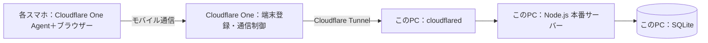

# アーカイブ：PCをサーバーにして複数スマホから使うための実装計画

**この初期計画は完了し、localhost管理画面を含むPC版専用構成へ更新されました。現在の手順・仕様は[PC版README](../cooking-app/README.md)を参照してください。**

更新日：2026年9月28日。現在公開中のSites版は変更せず、**このPCで動く別の運用版**を追加している。PC版アプリのコード・SQLite保存・端末登録・起動・バックアップ機能は実装済み。利用期間は3日間なので、Windowsのモバイル ホットスポットへ参加スマホを接続し、PCのローカルアドレスから利用する方式を採用する。外部サービスやアカウント共有は不要。実際の起動方法は[READMEの短期利用手順](../cooking-app/README.md#3日間だけスマホから使う)を参照する。ホットスポットの起動とスマホ実機からの到達性は未確認。

## 目標と前提

- 2枚の鉄板、楕円の追加・開始・90〜110秒調整・赤表示・上スワイプ削除を維持する。
- 複数スマホをこのPCのモバイル ホットスポットに接続し、同じ調理画面を閲覧・操作できる。
- スマホはモバイルデータではなくPCホットスポット経由でアプリへアクセスする。WindowsのホットスポットがPCの既存インターネット接続を要求する場合はその接続を使い、追加サービス料金は発生させない。
- ChatGPT・GitHub・Cloudflareなどの追加アカウントをスマホ間やスタッフ間で共有しない。アプリ用端末登録コードは端末ごとに発行する。
- 最初の検証規模はスマホ5台、調理ボード1面。同期目標は通常約1秒とし、スマホ実機で確認する。
- PCの停止・スリープ中、ホットスポット停止中は共有操作できない。

## 店外からモバイル回線で使う構成（今回の3日間利用では使わない）

Cloudflareには**PCへの接続経路**を担わせる。調理画面、API、データの正本はPCで動かし、Cloudflare Workers / D1やGitHub Pagesは運用に使わない。PCには`cloudflared`、各スマホにはCloudflare One Agentを入れる。スマホでは接続アプリを有効にした後、ブラウザーでPCの**プライベートIPアドレスとポート**を開く。独自ドメインを購入しない。[プライベートIP接続の公式手順](https://developers.cloudflare.com/cloudflare-one/networks/connectors/cloudflare-tunnel/private-net/cloudflared/connect-cidr/)

例示URLは `http://<PCの固定したLANアドレス>:<アプリのポート>/`。実際のアドレスはこのPCとルーターの設定確認後に決める。スマホからの経路はCloudflare One ClientとTunnelで接続し、ルーターの外部向けポート開放や固定グローバルIPを使わない。PCのLANアドレスはルーターで固定予約する。スマホの接続先ネットワークが同じアドレス帯の場合は経路競合を実機で確認する。

Cloudflare Oneの初回端末登録では、**端末ごとに許可された担当者のメールアドレス宛ての一時コード**を使用する。共有メールのログインを前提にしない。専用端末に担当者メールを使えない場合は、端末配布方法を別途設計し、同じ資格情報を全台へ複製しない。[端末登録の公式説明](https://developers.cloudflare.com/cloudflare-one/team-and-resources/devices/cloudflare-one-client/deployment/device-enrollment/)、[一時コード認証](https://developers.cloudflare.com/cloudflare-one/integrations/identity-providers/one-time-pin/)

## 現在のフェーズ

**現在：フェーズ2「残りのスマホをアプリへ登録」**。フェーズ1は完了し、iPhone Safariからホットスポット経由で`/api/health`が応答しました。最初のiPhoneもアプリ登録済みです。複数台を使う直前に、次のスマホ用コードを発行し、調理画面へ登録します。Quick Tunnel、Cloudflare Zero Trust組織、スマホへの接続Agent登録は今回行いません。

| フェーズ | 作業 | 完了条件 | 状況 |
| --- | --- | --- | --- |
| 0. アプリ起動 | Node.jsでPCサーバーを起動 | PC上で`/api/health`が`status: ok`を返す | **完了**。ローカルHTTPで確認済み |
| 1. PCホットスポット・スマホ接続 | Windowsのモバイル ホットスポットを有効にしてスマホを接続 | スマホから`http://<ホットスポット側PCのIPv4>:8780/api/health`が開く | **完了**。iPhone Safariで`status: ok`を確認 |
| 2. 各スマホをアプリへ登録 | PCで端末ごとに登録コードを発行 | 利用する全端末の登録後に調理画面が表示される | **進行中**。最初のiPhone登録済み |
| 3. 3日間の運用確認 | 2台以上で操作し、PC・ホットスポットを維持 | 操作が共有され、終了後にホットスポットと任意のFW規則を停止できる | **未着手** |

## 長期利用を再検討するときの作業段階（今回不要）

| 段階 | 作業と主な変更箇所 | 完了条件 | 目安 |
| --- | --- | --- | --- |
| 0. 接続方式の実証 | Cloudflare管理者アカウント、PCの`cloudflared`、プライベートIP `/32`、スマホAgent、Split Tunnel、通信制限を構成してモバイル回線から接続 | 独自ドメイン・有料プラン・ルーター開放なしで接続できる | **未着手**。管理者アカウントとスマホが必要 |
| 1. PC版アプリへ移植 | 既存の調理画面・CSS・データモデル・同期処理を再利用し、静的React画面＋Node.js APIへ分離 | PC本番プロセスで画面と`/api/board`が動く | **実装・本番ビルド済み** |
| 2. 保存・同時操作 | D1をPC内SQLiteへ置換し、版番号・操作ID・サーバー時刻を継承 | 登録後の追加・開始・永続保存が動く | **実装済み**。ローカルHTTPの登録・追加・開始を使い捨てDBで確認。複数端末と再起動後の実機確認は未完了 |
| 3. 利用者・端末制御 | 個別メールでCloudflare端末登録。アプリ側は一回限りコードと失効可能な端末別セッションを使う | 許可端末だけが操作でき、権限を個別に停止できる | **アプリ側実装済み**。Cloudflareの端末・ネットワークポリシー設定待ち |
| 4. 常時運転と復旧 | PCサーバー自動起動、ログ、SQLiteバックアップ・復元を用意 | 再ログオン後に自動復帰し、バックアップから戻せる | **スクリプト・CLI実装済み**。使い捨てDBでバックアップ、復元、復元前DBの保管を確認。Windowsタスク登録とTunnelサービスの実機確認は未完了 |
| 5. 実機・運用試験 | iPhone/Android、Wi-Fi/モバイル回線混在、複数台、通信断、端末失効、再起動を確認 | 受入条件を満たし、スタッフが操作できる | **未着手**。実機・Cloudflare接続が必要 |

店外から携帯回線だけでPCへ接続する要件に戻る場合は、以下のCloudflare One手順を別計画として再検討する。今回は短期・店内利用のため対象外。

### 長期利用時の実機登録手順（今回の3日間利用では不要）

各フェーズは完了条件を確認してから次へ進みます。Cloudflareの画面名は変更される場合があるため、見つからない場合はリンク先の公式手順を参照してください。

#### フェーズ0：Free組織と接続先の準備

1. 管理者本人のCloudflareアカウントを用意して二要素認証を有効にし、Zero Trust組織を作成して**Free**を選択します。購入・有料オプション追加・ドメイン購入は不要です。組織作成時に支払情報入力を求められる場合がありますが、Freeの表示が`$0`であることを確認します。[開始手順](https://developers.cloudflare.com/cloudflare-one/setup/)、[料金](https://www.cloudflare.com/sase/products/access/)
2. Zero Trustのチーム名を決めて控えます。Cloudflare One Clientで各スマホを組織へ接続する際に必要です。Cloudflare管理者アカウントは共有しません。
3. 新しい組織ではCloudflareログインが標準で、One-time PINは自動で有効にならないため、メール認証で端末を登録する場合は設定します。**Zero Trust > Integrations > Identity providers > Add new identity provider > One-time PIN**で追加し、次に**Team & Resources > Devices > Device profiles > Management > Device enrollment > Manage**で、利用者の個別メールアドレスだけを許可し、Login methodsでOne-time PINを選択して保存します。[端末登録権限](https://developers.cloudflare.com/cloudflare-one/team-and-resources/devices/cloudflare-one-client/deployment/device-enrollment/)、[One-time PIN](https://developers.cloudflare.com/cloudflare-one/integrations/identity-providers/one-time-pin/)
4. PCで`Get-NetIPConfiguration`を実行し、実際にインターネットへ接続しているWi-Fi/EthernetのIPv4アドレスを確認します。VPN、仮想スイッチ、モバイルホットスポットなどのアドレスは選びません。ルーターのDHCP予約で、そのIPv4アドレスをこのPCに固定します。

**完了条件：** FreeのZero Trust組織、チーム名、許可された端末登録メールとOne-time PINが設定され、選んだPCのIPv4アドレスが再起動後も同じになる。

#### フェーズ1：このPCをTunnelへ接続

1. Cloudflareダッシュボードの **Networking > Tunnels > Create a tunnel** でリモート管理Tunnelを作り、名前を付けます。
2. Windows向けの接続コマンドを確認します。このPCはWindows ARM64のため、Windows用の**64-bit x64版`cloudflared`**を使用します。Cloudflareの現行配布表にWindows ARM64版はありません。[ダウンロード](https://developers.cloudflare.com/cloudflare-one/networks/connectors/cloudflare-tunnel/downloads/)
3. 管理者PowerShellでダッシュボードが表示するTunnel接続コマンドを実行し、Tunnelの状態が **Healthy** になるのを確認します。接続トークンは秘密情報として扱い、チャット、GitHub、READMEには貼りません。Windows版`cloudflared`は自動更新されないため、更新確認も運用に含めます。

**完了条件：** ダッシュボードでTunnelがHealthyになり、Windows再起動後もサービスとして再接続する。

#### フェーズ2：PCのIP・ポートだけをルーティング

1. **Networking > Routes > Create route > Tunnel CIDR** でフェーズ1のTunnelを選び、PCの予約済みIPv4だけを`<IPv4>/32`として登録します。`/24`などLAN全体は登録しません。[CIDRルート](https://developers.cloudflare.com/cloudflare-one/networks/connectors/cloudflare-tunnel/private-net/cloudflared/connect-cidr/)
2. Cloudflare One ClientのDevice profileでSplit Tunnelsを**Include**にし、同じ`<IPv4>/32`だけを含めます。これにより、スマホの通常のモバイル通信をすべてTunnelへ流さず、PC宛て通信だけをCloudflare Oneへ送ります。
3. GatewayのTCP proxyを有効にし、ネットワークポリシーで許可対象の個別ユーザーから`<IPv4>:8780/TCP`だけを許可します。PCの別ポートや他のプライベート宛先への通信も制限します。ネットワークポリシーはGateway proxyが有効でないと適用されません。[ネットワークポリシーの準備](https://developers.cloudflare.com/cloudflare-one/traffic-policies/get-started/network/)

**完了条件：** 登録済み端末の通信だけがPCのTCP 8780へ到達し、他ポートには到達しない。ルーターのポート開放は行いません。

#### フェーズ3：PCアプリを起動して接続確認

1. このPCでリポジトリの`cooking-app`フォルダーを開き、ビルド済み画面があることを確認します。未ビルドなら[READMEの手順](../cooking-app/README.md)でNode.js 24.19.0以上を使って`npm ci`と`npm run build:pc`を実行します。
2. PowerShellから`scripts/run-pc-server.ps1`を実行し、Node.jsサーバーを起動します。PC自身で`http://localhost:8780/api/health`を開き、`status: ok`を確認します。
3. 最初のスマホはWi-Fiを切り、モバイル通信を使います。Cloudflare One Agentをインストールし、フェーズ0で許可した本人のメールでチームへ登録します。Agentが接続済みになってから、`http://<IPv4>:8780/api/health`を開きます。
4. Health応答が確認できたら、ブラウザーで`http://<IPv4>:8780/register`を開き、端末登録フォームが表示されることを確認します。

**完了条件：** Wi-Fiを切ったスマホからも`/api/health`が応答し、PCアプリの登録画面が表示される。

#### フェーズ4：スマホをアプリへ登録

1. PCで`npm run device:pc -- add`を実行します。CLIに表示されたIP一覧から、フェーズ0で予約したIPv4の`http://<IPv4>:8780/register`を使います。
2. 発行から15分以内に、スマホでその`/register`を開き、管理者が表示した一回限り登録コードと端末名を入力します。コードは一台に一回だけ使えます。各スマホ用に個別のコードを発行します。
3. 調理画面が開いたら、鉄板へ楕円を追加して他のスマホにも同じ状態が表示されることを確認します。2台目以降もCloudflare One Agent登録とアプリ登録を各端末で繰り返します。

**完了条件：** 少なくとも1台の実機がCloudflare One経由で登録され、画面とAPIを利用できる。2台目でも共有状態が一致する。

#### フェーズ5：店舗利用前の確認

Windowsファイアウォールと同一LANからの直接HTTP到達可否を確認します。同一LANからポート8780へ直接到達できる状態では、HTTPセッションCookieがLAN内で保護されないため、そのままスタッフ端末を配布しません。必要に応じてネットワーク分離やHTTPS化を追加します。安全性・同期・スリープ復帰・端末失効を確認した後、`scripts/install-pc-autostart.ps1`でPCサーバーのログオン時自動起動を登録し、PCがスリープしない運用にします。

**完了条件：** モバイル回線と店舗Wi-Fiでの経路、直接LANアクセス、複数端末同期、再起動、失効が確認でき、管理者が問題なく運用できる。

### 段階1〜3：現行アプリを移す

- React/SVGの操作画面と`lib/kitchen-model.ts`の状態遷移、`lib/use-kitchen.ts`の約1秒間隔の同期・時刻補正を引き継ぐ。
- 専用の本番用Node.jsサーバーを追加し、静的画面と`GET/POST /api/board`を同じオリジンで提供する。現行の`wrangler dev`は運用に使わない。
- SQLiteはこのPCのNode.js v24.19.0で使える `node:sqlite` を採用。トランザクションと`node:sqlite`のバックアップ機能を使う。Node.js v24.19.0で本番ビルド後のローカルHTTP動作を確認した。Node.jsを更新する場合はアプリ・DBの起動を再確認する。[Node.js SQLite公式資料](https://nodejs.org/api/sqlite.html)
- `boards`・`operations`をSQLiteに作り、1操作を1トランザクションで確定する。操作IDの再送は二重適用せず、同じ楕円の古い更新バージョンを拒否する。時刻はPCのサーバー時計を基準にする。
- `app/page.tsx`・`app/api/board/route.ts`のChatGPT認証、`app/chatgpt-auth.ts`、`app/kitchen.tsx`の再ログイン先を、PC版の端末認証へ置換する。
- PCだけで短時間・一回限りの端末登録コードを発行し、スマホごとにアプリ用セッションを作る。端末名、発行時刻、失効状態をPCのSQLiteで管理する。登録コードとセッション秘密値は平文でDBに残さず、管理者は端末単位で失効できる。これはCloudflare側のAgent登録とは別の、アプリ画面・API用の制御。
- POSTでは認証に加え、同一オリジン、JSON形式、入力長、操作内容を現在と同様に検証する。`Cache-Control: no-store`を維持する。権限切れは401として操作を止め、登録し直す導線を出す。
- PCの画面/APIのポートをルーターでインターネットへ開けない。Windowsファイアウォールとローカルネットワークからの到達可否を実機で確認する。Cloudflare Tunnelのプライベートルートだけでは、同一LANの端末からPCのIP/ポートへの直接接続は防がれない。Cloudflare Tunnel経由の通信はTunnelを動かすホストのローカルIPを送信元としてサービスへ届くため、ファイアウォールでTunnel経由だけを他のLAN通信と単純に判別できるとは限らない。[CloudflareのTunnel接続説明](https://developers.cloudflare.com/cloudflare-one/networks/connectors/cloudflare-tunnel/)。未確認のLANからHTTPへ到達する状態では、スタッフのセッションを配布しない。ローカルWi-Fiの端末隔離、ファイアウォールまたはHTTPS化を実機で決める。

### スマホのHTTPとPWAについて

プライベートIPへ `http://` で開く場合、WARP接続中でも**スマホのブラウザーはHTTPSのWebサイトとして扱わない**。PC版はHTTPでも動くUUID v4生成を`crypto.getRandomValues()`で実装済みである。[MDN：getRandomValues](https://developer.mozilla.org/en-US/docs/Web/API/Crypto/getRandomValues)

HTTPのプライベートIPではサービスワーカーを登録できないため、初版は**通常のブラウザー画面**として提供し、PWAのオフライン案内・インストール性を受入条件に入れない。「ホーム画面に追加」ができてもOSによる単なるショートカットの可能性がある。将来PWAを必須にする場合は、端末が信頼する証明書を用意してHTTPS化する別工程とする。[MDN：セキュアコンテキスト](https://developer.mozilla.org/en-US/docs/Web/Security/Defenses/Secure_Contexts)、[Service Worker](https://developer.mozilla.org/en-US/docs/Web/API/Service_Worker_API)

HTTPのアプリ用セッションCookieに`Secure`属性は付かない。遠隔のスマホからはCloudflare Oneの暗号化されたプライベートルートで利用する設計だが、同じLANからの直接アクセス可否は別途確認が必要である。LAN経由のHTTPを許可する必要がある場合は、HTTPS化またはネットワーク分離を追加してから利用開始する。

### 段階4〜5：運用確認と受入条件

- PC本番プロセスと`cloudflared`がWindows起動後に復帰し、PCをスリープさせた場合はスマホが「未接続」と表示して操作を止める。[Windowsサービス化の公式資料](https://developers.cloudflare.com/tunnel/features/locally-managed-tunnels/as-a-service/windows/)
- SQLiteのバックアップをアプリ稼働中も整合性のある方式で作り、別ファイルへ復元して内容・更新連番・操作履歴を確認する。保存先と世代数を運用手順に記す。
- 5台で鉄板1・2への同時追加、空白タップ開始、左右スワイプ、赤への変化、上スワイプ削除を試す。モバイル回線とWi-Fiを混在させ、端末時計をずらす。
- 同じ操作IDの再送、同一楕円の同時変更、二重開始、切断復帰、ブラウザー再読込、PC再起動を試し、二重作成やタイマーの再開始が起きないことを確認する。
- 未登録スマホ、Cloudflare側で失効したスマホ、アプリ側で失効したスマホが画面とAPIを利用できないことを確認する。アプリ端末はPCで`npm run device:pc -- list`と`npm run device:pc -- revoke 端末ID`を使って管理する。
- 8時間相当の運用でPCのCPU・メモリ・ディスク、接続断、同期遅延を測る。操作後の他端末への反映は通常約1秒を目標とし、到達しなければ取得間隔や通信方式を調整する。
- 公開中のSites版に調理データが残っている場合は、切替時に空のボードで始めるか、必要な状態だけを安全に移すかを調理の合間に決める。動作中のタイマーを両方のサーバーで並行操作しない。

## 今回の短期利用で用意するもの

モバイル ホットスポット機能が使えるWindows PC、既存のPCインターネット接続、利用するiPhone/Android、Node.js 24.19.0以上、参加端末だけが知るWi-Fiパスワードを用意する。スマホにChatGPT・GitHub・Cloudflareのアカウントを追加する必要はない。PC版アプリは[README](../cooking-app/README.md)の手順で起動・管理する。

Wi-Fi Directのホットスポットアダプターやスマホからの到達性はWindowsの設定・ドライバーに依存するため、実際にオンへ切り替えて確認する。`netsh wlan show drivers`の`Hosted network supported: No`だけでは、Windows設定の「モバイル ホットスポット」機能の可否は決まりません。モバイル ホットスポットはWindows 10/11の設定からPCのインターネット接続をWi-Fi共有する機能です。[Microsoftの設定手順](https://support.microsoft.com/en-us/windows/experience/connectivity-networking/use-your-windows-device-as-a-mobile-hotspot)。ホットスポットが使えない場合は、その時点でQuick Tunnel等の外部経路へ切り替えるかを判断する。
