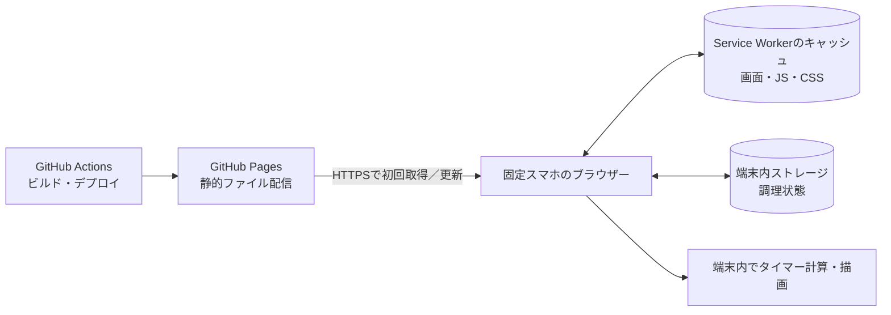

# 現行運用の正本：固定1台のスマホで使うGitHub Pages版

更新日：2026-10-10
適用範囲：現在の運用・サポート対象は、固定したスマートフォン1台の同じブラウザー保存領域で使うGitHub Pages版。ログイン、端末登録、端末間同期は行わず、調理状態は利用ブラウザーの`localStorage`に保存する。利用する入口（通常タブまたはホーム画面のアプリ表示）とブラウザーを固定する。

この資料は現行の運用・サポート範囲を決める正本である。利用者向けの導入手順は[アプリREADME](../cooking-app/README.md)、文書群の入口は[docs索引](README.md)を参照する。機能別計画や過去案はこの資料の運用範囲を変更しない。

## 現行運用の範囲と公開状況

- GitHub Pagesは静的な画面・JavaScript・CSS等を公開する。タイマー処理と調理状態の読み書きは固定スマートフォンのブラウザー内で行い、調理状態をGitHubやPagesへ同期しない。
- 利用単位は固定スマートフォン1台・1ブラウザーの保存領域。複数端末の共有、アカウント登録、認証、クラウドバックアップは現行対象に含めない。
- 保存先は`localStorage`であり、ブラウザーのサイトデータ削除、プライベートブラウズ終了、端末交換などで調理状態が失われる可能性がある。画面の「データ管理」から盤面・タイマー・完成ボックス・実行記録・次IDを含むJSONを手動で保存し、検証・確認後に復元できる。JSONはダウンロード先に保存される手動バックアップであり、クラウド同期・自動バックアップではない。CSVは完了済み実行記録だけで、盤面復元には使えない。ブラウザーやURLのorigin、ホーム画面起動と通常タブなどの保存領域差により、別データとして見える場合もある。
- Service Workerは静的ファイルのキャッシュに使い、バックグラウンドでタイマーを動かし続けたり、ロック中に確実な通知を行ったりする機能ではない。オフライン起動は必要なキャッシュが残っている場合に限る。
- Screen Wake Lockは画面消灯を抑える補助で、OSの省電力設定等で拒否・解除されることがある。Web Locksは同じ保存領域を使う複数タブの操作排他に使う設計だが、対象端末での動作確認が必要。
- ActionsはPages用成果物のビルドと公開を行う。アプリ稼働中のタイマー用APIや共有データベースは持たない。
- PC用Node.jsサーバー、API、SQLite、管理・端末登録画面、PC向けクライアントや関連設定はリポジトリ内に残っている。これらはlegacy実装であり、現在の運用・サポート対象ではない。PC用サーバー、SQLite、管理画面、WebMCPをPages成果物に含めない。
- Pages専用ビルドの成果物については、2026-10-02の実装記録でPC API、登録画面、WebMCPコードを含まないことを確認したと記録されている。現在のURL到達性や固定端末上の正常動作をこの記録から推定しない。
- 2026-10-03の[デプロイ記録](github-pages-deployment-plan.md)には、公開画面でWeb Locks APIのoptions指定による実行時エラーがあったと記録されている。修正commit `67de70e` はその後mainに反映された。
- 2026-10-09の公開記録では、Actions run 13が成功し、公開URLのHTML・更新後のJavaScript・CSSがHTTP 200を返した。これが確認できた最後の公開状態であり、2026-10-10以後の到達性は未確認。
- 固定スマートフォンでの実操作、ホーム画面からの起動、オフライン再起動、画面ロック復帰、複数タブ制御の受け入れ確認は未確認。HTTP 200は実機運用確認を意味しない。
- Pagesサイトは公開アクセス可能である。別端末・別ブラウザー環境から開いた場合は、その環境の保存領域が使われるため、Pagesへのアクセスだけで固定スマートフォンのデータが同期されることはない。一方、固定スマートフォンまたは同じブラウザー保存領域を使える人は、その中の状態を閲覧・操作できる。URL非公開はアクセス制御にならない。

本資料に記す機能方針は現行の目標アーキテクチャを示す。公開URLの現在の稼働や実機での受け入れ完了を保証するものではない。

## 構成方針

**固定スマホ1台で現在の盤面を管理し、調理中は画面を表示して使う条件なら、この構成は妥当。** GitHub Pagesは画面の配信に使い、すべてのタイマー操作・状態判定・保存はスマホのJavaScriptで行う。GitHub Actionsはアプリのビルド・公開だけを担当する。調理用のサーバー、クラウドAPI、共有DB、登録コード、認証処理は不要になる。

2026-10-02の再検討では、基本構成を採用し、初期実装に「オフライン再起動」「保存失敗への対処」「画面消灯への対処」「調理中に更新を適用しない仕組み」を追加する方針とする。画面ロック中の確実なアラームや、端末故障後のデータ復旧まで必要になった場合は追加設計が必要。

この方式は、データの正本を「PCのSQLite」から「固定スマホのブラウザー保存領域」へ移す設計。Pagesは画面を配るだけで、調理データはGitHubへ送らない。

初回取得・新しい版の取得にはインターネット接続が必要。PCと同じネットワークに接続する条件はなくなり、Wi-Fiまたはモバイル回線で導入できる。キャッシュの準備後は、通信が途切れても起動・操作できるようにする。

## PC／共有版の旧構成を置き換えるPages設計

| PC／共有版にあった機能 | Pages版での扱い |
| --- | --- |
| React画面 | 静的ファイルとしてGitHub Pagesから配信。既存の画面と図形描画を再利用 |
| `GET/POST /api/board` | 削除し、ブラウザー内の保存処理を呼ぶ |
| `data-pc/kitchen.sqlite` | `localStorage`へ置換。お好み焼きの配置、設定時間、開始時刻などの小さい状態だけを保存 |
| 700ms間隔の共有取得 | 削除。操作後にローカル保存し、表示用の再描画だけを行う |
| サーバー時刻の補正 | 削除。スマホの時刻を基準にする |
| 登録コード、端末Cookie、失効管理 | 削除。スマホ上でページを開けば使用できる |
| Windows PC起動、ファイアウォール、LANアドレス選択 | 不要。固定URLをスマホのホーム画面へ登録し、毎回同じ入口から使う |
| アプリの再起動 | Service Workerで必要な静的ファイルを保存し、オフラインでも盤面を開けるようにする |
| 手動バックアップ／復元 | Pages版の「データ管理」からJSONで盤面・タイマー・完成ボックス・実行記録・次IDを手動保存・復元する。CSVは完了済み実行記録だけを書き出す |

タイマーの残り秒数は毎秒保存せず、現在と同じく`startedAt`と設定秒数から計算する。操作時に状態を保存する。画面ロックやブラウザーの一時停止から戻ったときは、保存した時刻とスマホの現在時刻から残り時間を再計算する。

タイマー計算、配置位置補正、重なり判定、操作入力検証などの純粋な処理は、Node.js専用機能に依存しない`lib/kitchen-model.ts`を再利用できる。`lib/use-kitchen.ts`はサーバー取得・接続状態・再送処理を持つため、ローカル保存を行う形へ変更する。

**PC用ビルド成果物をそのままPagesへ置いても動作しない。** 旧共有版のフックは`/api/board`を呼び出し、画面は接続状態が`online`でなければ操作を禁止していた。Pages版ではAPI依存と通信状態による操作禁止を外し、操作可否を保存状態・データ検証結果から判断する。登録画面、管理画面、共有・再接続の案内文もPages版の対象から外す。

## 運用設計と実装上の保護策

| 項目 | 設計 |
| --- | --- |
| 保存の確定 | 操作を直列に処理し、最新状態の検証・変更・保存に成功してから画面に確定反映する。書き込み失敗を成功扱いにしない |
| 保存データの検証 | `schemaVersion`、`revision`、`items`を保存。読み込み時はID、位置、設定時間、開始時刻等を検証する。破損・未対応バージョンを黙って空盤面で上書きしない |
| オフライン再起動 | HTML、JS、CSS、アイコンを一式キャッシュ。初回キャッシュの準備完了を表示し、機内モードでの再起動を実機確認する |
| 更新の適用 | 新版は背景で取得し、調理終了後に利用者が更新を選ぶ。計測中に強制再読み込みしない。キャッシュ更新で調理データを消さない |
| 画面表示の維持 | 対応端末ではScreen Wake Lockを利用し、復帰時に再取得する。取得・解除状態を表示。利用できない場合は端末の消灯設定で対応する |
| 重複起動への対処 | 同じ保存領域を複数タブが更新しても古い盤面で上書きしない。対象端末でWeb Locksを確認し、操作単位で排他・再読み込み・保存を行い、他タブの変更を反映する |

`localStorage`は今回の少量データに適しており、初期段階でIndexedDBへ変更する必然性はない。ただし、読み書きの例外を処理し、保存できない場合は現在の盤面を保って新規操作を止め、利用者に知らせる。JSON文字列は一つのアプリ専用キーで保存し、盤面が複数キーへの途中保存にならないようにする。初回起動と読み込みエラーは区別する。

保存領域はURLのパスではなくorigin単位。同じ`<owner>.github.io`にある別プロジェクトと区別できるキー名を使う。ただしキー名は別サイトに対するアクセス制御にはならない。ホーム画面からの起動と通常ブラウザーのタブで保存領域が共通であるとは前提にせず、利用する入口を一つに固定する。ドメインやブラウザーを変える場合はデータ移行が必要になり得る。

タイマー表示は開始時刻と現在時刻から計算し、`setInterval`の実行回数を残り秒数にしない。画面が動作中の経過時間には`performance.now()`を使う設計が可能だが、端末スリープ中も進み続けることは前提にしない。再読み込み・復帰時は保存した開始時刻と端末の現在時刻で再計算する。時計変更まで含めた完全な補正はこの構成の保証対象にしない。[MDN: performance.now](https://developer.mozilla.org/en-US/docs/Web/API/Performance/now)

Service Workerは静的ファイルのキャッシュと更新に使う。常駐のタイマー実行やロック中の確実な通知の代替にはしない。更新ライフサイクルを考慮し、新版を無条件に即時適用しない。[MDN: Service Worker](https://developer.mozilla.org/en-US/docs/Web/API/Service_Worker_API)

Wake Lockは電池状態・省電力設定・画面の非表示などで拒否または解除されることがある。画面を維持する補助として扱い、ロック中に確実にアラームを鳴らす保証にはしない。[MDN: Screen Wake Lock](https://developer.mozilla.org/en-US/docs/Web/API/Screen_Wake_Lock_API) 同一origin内の操作の排他にはWeb Locksが使えるが、対象スマホで利用できることを確認する。[MDN: Web Locks](https://developer.mozilla.org/en-US/docs/Web/API/Web_Locks_API)

## 保存範囲と制約

- 保存データは、そのスマホ、そのブラウザー、そのサイトの保存領域に紐づく。他のスマホ、PCブラウザー、別ブラウザーとは共有されない。
- ブラウザーのサイトデータ削除、プライベートブラウズ終了、端末交換でデータが消えることがある。Pages版は手動JSONバックアップを読み込んで調理データを復元できるが、自動バックアップではない。JSONを端末外にも保管する。CSVは完了済み実行記録だけで、現在の盤面を復元できない。
- 同じホーム画面アイコンから使う。スマホが1台でも複数タブは開けるため、前述の排他と更新通知を設ける。Web Locksが使えない端末では、重複起動時の操作禁止などを別途設計する。
- 画面をロック中にJavaScriptが毎秒動き続ける保証はない。復帰時に残り時間を正しく追いつかせるが、ロック中の表示更新、音、通知はこの構成には含まれない。
- オフライン起動は静的ファイルのキャッシュが残っている条件で利用できる。サイトデータの削除などでキャッシュが消えた場合は、ネット接続して再取得する。キャッシュは調理データのバックアップにはならない。
- タイマーはスマホの時計を基準にする。端末の時計を手動で大きく変更すると、再開後の残り時間がずれる可能性がある。

ブラウザーの`localStorage`はサイトのorigin単位で保存され、ブラウザーセッションをまたいで残る。容量は今回の小さい状態には十分だが、ブラウザーが消去する可能性はあり、唯一の長期バックアップにはならない。[MDN: localStorage](https://developer.mozilla.org/en-US/docs/Web/API/Window/localStorage)、[MDN: 保存容量と消去条件](https://developer.mozilla.org/en-US/docs/Web/API/Storage_API/Storage_quotas_and_eviction_criteria)

## GitHub PagesとActionsの設定

- Pages専用のビルドを用意し、Actions workflowでその静的成果物だけを発行する。`cooking-app/`を作業ディレクトリとし、lockfileから依存を導入する。PC版のSQLiteや管理用ファイルは公開成果物に含めない。
- リポジトリ名を含むURL（`https://<owner>.github.io/<repo>/`）に合わせてViteの`base`、アセット参照、Service WorkerのURLとscope、ホーム画面用manifestの`start_url`と`scope`を設定する。基本入口は`/<repo>/`一つとし、サーバーのルーティングに依存しない。[Vite: GitHub Pagesへの公開](https://vite.dev/guide/static-deploy.html#github-pages)
- API用の秘密情報やGitHub tokenをブラウザーのJavaScriptに埋め込まない。調理状態の保存にGitHub APIを使わない。
- 公開コードを見られても調理状態は読めない設計。ただしURLを知る人はアプリを開いて自分のブラウザー内で使える。
- 今回は認証なしの公開サイトとして使う。ソースリポジトリをprivateにするだけではページへのアクセスは制限されない。誰かが同じURLを開いても、その人のブラウザーには別の調理状態が保存され、固定スマホのローカルデータは見えない。ページの閲覧制限が必要になった場合は、GitHubの対応プラン・組織設定または公開先を改めて検討する。[GitHub Pagesの公開範囲](https://docs.github.com/en/pages/getting-started-with-github-pages/configuring-a-publishing-source-for-your-github-pages-site)
- Pagesは静的ファイル配信なので、Actionsは更新時のビルド・公開だけを担当する。タイマー稼働中のAPI要求は発生しない。

GitHub Pagesの公式仕様は静的ファイルの公開を説明しており、GitHub Actionsをカスタムのビルド・公開手段として案内している。[Pagesの説明](https://docs.github.com/en/pages/getting-started-with-github-pages/what-is-github-pages)、[Actionsを使った公開](https://docs.github.com/en/pages/getting-started-with-github-pages/configuring-a-publishing-source-for-your-github-pages-site)

GitHubは、オンライン事業・商取引・商用SaaSを主目的とする無料ホスティング用途を制限している。この固定1台の内部タイマーが該当するとは公式説明だけでは断定できないが、一般向けの商用サービスとして提供する計画に変わる場合は公開先を再検討する。[Pagesの利用制限](https://docs.github.com/en/pages/getting-started-with-github-pages/github-pages-limits)

## PC legacyデータからの切り替え

PC legacyのSQLiteに調理中データが残っている場合、Pages版はそのDBを自動参照しない。切り替え時は空の盤面から始めるか、必要な状態を一度だけJSONでスマートフォンに読み込ませるかを決める。スマートフォン版へ切り替えた後、PC側の盤面は同期・更新されない。

## 初期設計で定めた実装順（履歴）

1. 固定スマホのOS・ブラウザーとホーム画面からの起動方法を決め、Wake LockとWeb Locksの利用可否を確認する。
2. APIから独立したローカル状態管理へ`use-kitchen`を変更し、保存データの検証・書き込み失敗処理・排他を追加する。
3. Node.jsサーバー、端末登録・管理API、Windows起動処理への依存をPages版ビルドから外し、画面の接続表示と案内文を変更する。
4. Service Workerのキャッシュ・更新制御とホーム画面用manifest、画面消灯への対処を追加する。
5. GitHub Actionsでビルドし、GitHub Pagesへ公開する。
6. 固定スマホで下記の導入条件を確認する。
7. 調理していない時間に切り替える。現在の盤面だけなら空盤面で開始する。SQLiteの状態を継続する必要があれば一度だけJSONで取り込む。

## 固定端末での導入確認条件

以下は導入確認の受け入れ条件として定めた項目であり、現時点で完了した実機検証結果を示すものではない。

- 通常の追加・開始・時間調整・終了・削除が、ネット接続の有無によらず使える。
- 調理中の再読み込み・アプリ終了後の再起動で盤面が戻り、経過した時間が反映される。
- 初回キャッシュ準備後、機内モードでホーム画面から起動できる。
- 画面非表示・ロックから復帰した際に表示が追いつき、Wake Lockを再取得するか解除状態を表示する。
- 保存エラーや不正な保存データで、成功表示や無断の盤面初期化が起きない。
- 同じ入口を複数タブで開いても、古いデータの上書きで操作が失われない。
- 計測中に新版を公開しても画面が強制更新されず、調理終了後の更新で盤面が保たれる。
- 実際のスマホの縦横表示で、残り時間の読み取りとタップ操作に問題がない。

## 実装・公開の記録

### ローカル実装記録（2026-10-02）

- Pages専用の画面・Vite設定・Actions公開workflowを追加。
- 調理盤面を端末内に保存し、保存データの形式を確認してから読み込む。書き込み失敗は操作を確定せず、複数タブはWeb Locksで同時編集を止める。
- Service WorkerでPagesのHTML・JavaScript・CSS・アイコンをキャッシュし、通信断後の起動と、調理中に新版を適用しない更新操作を追加。
- 調理中はScreen Wake Lockを試し、対応しない・解除された状態を画面に表示。
- Pages版をサブパスでビルドし、成果物にPC API・登録画面・WebMCPコードが含まれないことを確認した記録がある。TypeScript確認、変更箇所のLint、PC版ビルドも実行済みと記録され、自動テストは未実施とされている。

### 初回GitHub Pagesデプロイ記録（2026-10-03）

- [デプロイ修復記録](github-pages-deployment-plan.md)によると、Actionsの再実行 attempt 2 が成功し、`https://raymee675.github.io/Raymee-Kitchen/` はHTTP 200で「鉄板タイマー」のHTMLを返した。
- 同じ確認で、画面内の`navigator.locks.request`が`ifAvailable`と`signal`の同時指定を拒否して操作が停止する実行時エラーが報告された。修正commit `67de70e`は後日mainに反映された。
- 2026-10-09のActions run 13成功とHTTP 200確認は、上の「現行運用の範囲と公開状況」に記載した。固定スマートフォンの実運用確認とは区別する。

## 関連する過去の検討

複数スマホ共有を前提にした[GitHub Pages評価](github-pages-replacement-assessment.md)と、メール／登録コード送信案[接続案内の設計](connection-delivery-architecture.md)は、今回の単一スマホ・認証不要という前提には適用しない。
